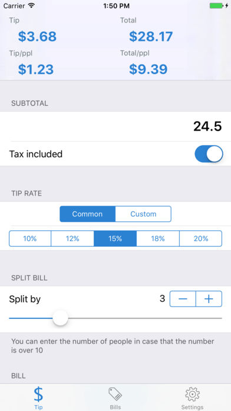

# TipCalc

TipCalc is an iOS application for quick tip calculation and bill splitting, which can be done directly from Notification Center. TipCalc is written in the latest Swift and open source under MIT License. Available on [App Store](https://appsto.re/us/GALzib.i)

# Features

## Calculation from notification center

## Simple calculator UI

## Tip card generation

## Automatically record bills

## Charts and statistics

# License

MIT License